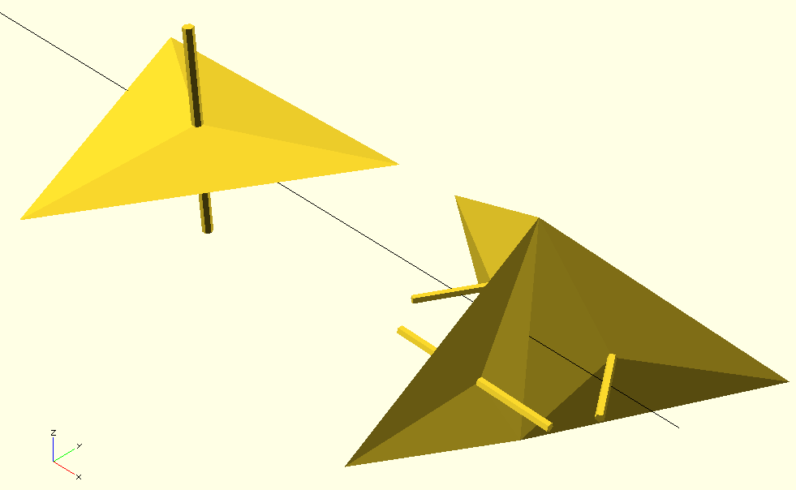

# 3D Koch Fractal

### Basics on Koch curve

Koch curve is a mono-dimensional fractal that can be made tri-dimensional with an approach similar to the one followed for Sierpinski fractal. Koch curve is called also snowflake fractal because of its shape.


This fractal is said mono-dimensional because it is composed solely by lines, even if placed in a bi-dimensional space. The (obviously recursive) procedure to generate a Koch curve is simple:

1. For each segment in the space:
   1. Divide segment in three equal sub-segments
   2. Replace the central sub-segment with two sub-segments, identical to removed one, placed as a triangle
2. Repeat step 1 until number of iterations reached

The final result, at different numbers of iteratios, is shown in the figure below (from Wikipedia).

---

### Koch 2D with openSCAD

Before to face the tri-dimensional version, it is worth to make an intermediate step first and generate the bi-dimensional one. Before to proceed it is necessary to explain a fundamental property of fractals: the starting shape is not relevant for the final result, because with an infinite number of iterarions, shape itself is reduced to points of infinitely small size. The shape of a fractal is basically contained only in the geometric transformations, whichever the shape used at start. In our case, in order not to have to iterate infinitely, we wisely choose a shape that match the final shape given by the geometric transformation.

So, for the bi-dimensional version, we replace the starting mono-dimensional segment with an isosceles triangle, that is the envelope of the structure after the first step of above figure. We change also the recursive procedure, that now replaces a single isosceles triangle with two isosceles triangles, each with the base on one of the oblique sides of the original triangle and internal to the original triangle itself.

The key of these transformations is that the replacing triangles are fully contained in the original triangle and original perimeter is exactly preserved, even if a portion is left void. Increasing iterations of this procedure you will see that starting shape is every step less visibile, while overall shape is every step more similar to the ideal Koch curve. As stated above, shape is in the geometric transformation, not in starting shape.


---

### Koch 3D with openSCAD

Passare alla versione tridimensionale della curva di Koch non è così intuitivo come lo era stato per Sierpinski, principalmente perché non possiamo usare una piramide come solido di partenza, anche se a prima vista sembrerebbe logico. Per ottenere l’analogo della trasformazione di Koch in tre dimensioni ci fa più gioco un solido composto da due piramidi isosceli una appoggiata sulla base dell’altra.

Non solo le due piramidi devono essere isosceli, ma anche con precise proporzioni, perché quello che vogliamo è una trasformazione nello spazio che porti un certo numero di queste doppie piramidi ad occupare lo stesso volume esatto della piramide iniziale, lasciando vuoto lo spicchio caratteristico della curva di Koch.


La figura sottostante (che evidenzia il triangolo delle basi e l’asse verticale, senza mostrare le pareti oblique) cerca di far comprendere le trasformazioni spaziali utilizzate: la doppia piramide iniziale è sostituita con tre doppie piramidi, un cui lato della base viene posizionato al posto dell’asse verticale di quella originaria.



Si può notare come l’altezza delle due piramidi, creando un lato obliquo inferiore a quello della base, fa si che si crei uno spicchio vuoto tridimensionale, quello che ci serve per generare l’effetto Koch in 3 dimensioni. Applicando ricorsivamente le trasformazioni, si ottiene il frattale di Koch in 3D, di cui sotto vediamo una versione a 6 livelli di ricorsione.


---

### Show me the code

```openscad
translate([0,-200,0]) koch2D(100,1,1);
translate([120,-200,0]) koch2D(100,1,2);
translate([0,-250,0]) koch2D(100,1,3);
translate([120,-250,0]) koch2D(100,1,4);
translate([0,-300,0]) koch2D(100,1,5);
translate([120,-300,0]) koch2D(100,1,6);
translate([0,-350,0]) koch2D(100,1,7);
translate([120,-350,0]) koch2D(100,1,8);

translate([-360,0,0]) koch3D(100,1,1);
translate([-240,0,0]) koch3D(100,1,2);
translate([-360,-120,0]) koch3D(100,1,3);
translate([-240,-120,0]) koch3D(100,1,4);
koch3D(100,1,6);

translate([200,0,0]) rotate([0,0,180]) koch3D_structure(100,1,1);
translate([320,0,0]) rotate([0,0,180]) koch3D_structure(100,1,2);

// koch 3D fractal
module koch3D(ww,nn,mm) {
  if (nn<mm) {
    rotate([0,0,120])
      rotate([0,90,0])
        translate([0,ww/(2*sqrt(3)*3/2),0])
          koch3D(ww*2/3,nn+1,mm);
    rotate([0,0,-120])
      rotate([0,90,0])
        translate([0,ww/(2*sqrt(3)*3/2),0])
          koch3D(ww*2/3,nn+1,mm);
    rotate([0,0,0])
      rotate([0,90,0])
        translate([0,ww/(2*sqrt(3)*3/2),0])
          koch3D(ww*2/3,nn+1,mm);
    
  } else {
    tetrion(ww);
  }
}

// double pyramid
module tetrion(ww) {
  pp = [[-ww/2,-ww/(2*sqrt(3)),0],
        [ww/2,-ww/(2*sqrt(3)),0],
        [0,ww*(sqrt(3)/2 - 1/(2*sqrt(3))),0],
        [0,0,ww/3],
        [0,0,-ww/3]];
  ff = [[3,1,0],
        [3,2,1],
        [3,0,2],
        [0,1,4],
        [1,2,4],
        [2,0,4]];
  polyhedron(pp,ff);
}


// koch 3D fractal structure
module koch3D_structure(ww,nn,mm) {
  if (nn<mm) {
    rotate([0,0,120])
      rotate([0,90,0])
        translate([0,ww/(2*sqrt(3)*3/2),0])
          koch3D_structure(ww*2/3,nn+1,mm);
    rotate([0,0,-120])
      rotate([0,90,0])
        translate([0,ww/(2*sqrt(3)*3/2),0])
          koch3D_structure(ww*2/3,nn+1,mm);
    rotate([0,0,0])
      rotate([0,90,0])
        translate([0,ww/(2*sqrt(3)*3/2),0])
          koch3D_structure(ww*2/3,nn+1,mm);
    
  } else {
    tetrion_structure(ww);
  }
}

// double pyramid structure
module tetrion_structure(ww) {
  pp = [[-ww/2,-ww/(2*sqrt(3)),0],
        [ww/2,-ww/(2*sqrt(3)),0],
        [0,ww*(sqrt(3)/2 - 1/(2*sqrt(3))),0],
        [0,0,ww/30],
        [0,0,-ww/30]];
  ff = [[3,1,0],
        [3,2,1],
        [3,0,2],
        [0,1,4],
        [1,2,4],
        [2,0,4]];
  polyhedron(pp,ff);
  translate([0,0,-ww/3]) cylinder(d=ww/30,h=2*ww/3);
}


// koch 2D fractal
module koch2D(ww,nn,mm) {
  if (nn<mm) {
    translate([((ww/sqrt(3))*(sqrt(3)/2-1/sqrt(3))),0,0])
      rotate([0,0,150])
        translate([0,-ww/(3*2),0])
          koch2D(ww/sqrt(3),nn+1,mm);
    translate([-((ww/sqrt(3))*(sqrt(3)/2-1/sqrt(3))),0,0])
      rotate([0,0,-150])
        translate([0,-ww/(3*2),0])
          koch2D(ww/sqrt(3),nn+1,mm);
  } else {
    tria(ww);
  }
}

// triangle
module tria(ww) {
  pp = [[-ww/2,0],[ww/2,0],[0,ww/(2*sqrt(3))]];
  polygon(pp);
}
```
