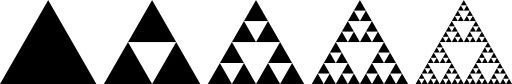
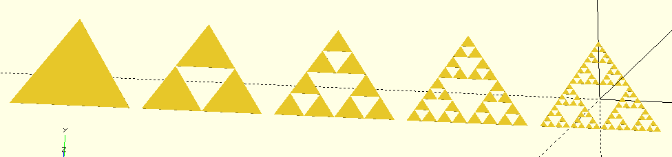
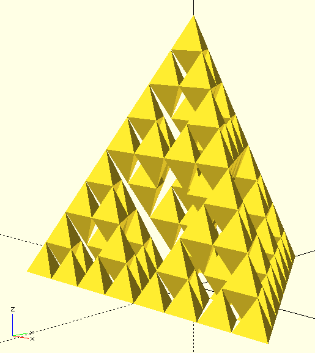
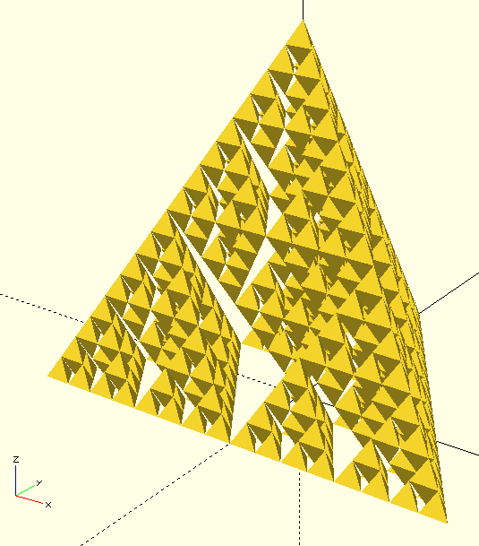
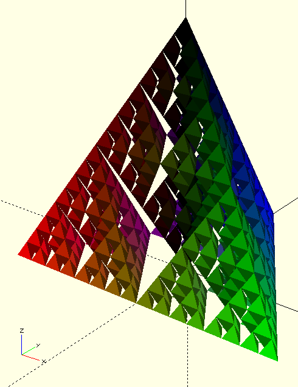

# 3D Sierpinski Fractal

### Basics on Sierpinski triangle

Among the peculiarities of openSCAD there is the support to recursion applied to 3D drawing. It is something I experienced when I was a kid messing with LOGO, actually I was too young to understand the abstraction of recursion concept, but I remember I found easy and powerful to define a basic graphic behavior and to repeat it in different positions with different scale and orientation. Today, after university studies and many personal experiments, I found quite natural to draw a Sierpinski fractal in openSCAD using recursion.

The "manual" procedure is quite simple:

1. Draw one equilateral triangle on the sheet
2. Replace any equilateral triangle on the sheet with three equilateral triangles, with side half size of original one, each placed in a vertex
3. Repeat step 2 until number of iteration reached

Step 2 is the key of fractal generation, because at each iteration new details are added. Step 3 allows to repeat previous step for a predefined number of iterations, ideally an infinite one, but in practice limited to a very small number (definetely less than 10), because the computational effort grows exponentially with it.

The image below, taken from Wikipedia, show four iterations of the above procedure.



---

### Sierpinski 2D with openSCAD

Traducendo in codice quella procedura possiamo disegnare il triangolo di Sierpinski con openSCAD, con alcuni piccoli accorgimenti che semplificano e potenziano al tempo stesso il codice.

Durante gli studi superiori o universitari si impara che le funzioni ricorsive devono avere due caratteristiche:

- Un modo di richiamare sé stessa (la ricorsione vera e propria).
- Una condizione ed un comportamento ben preciso per il termine della ricorsione.

Se prendiamo le prime due iterazioni nella figura si capisce che il modo di richiamare sé stessa consiste letteralmente nel ripetere tre volte la chiamata a sé stessa, avendo cura di spostarsi in ciascuno dei vertici (una translate() in openSCAD) e dimezzare le dimensioni (ci serve un parametro della funzione che specifichi le dimensioni del triangolo). La condizione per il termine della ricorsione lo gestiremo passando alla funzione altri due parametri, il numero progressivo di iterazione a cui siamo arrivati, ed il livello massimo a cui arrivare (nella figura sopra è 5). Il comportamento da applicare al termine della ricorsione è il disegno del triangolo.

Traducendo tutto in codice openSCAD, questo è il risultato:




### Sierpinski 3D

Una volta compreso il meccanismo base è veramente semplice spingersi nella terza dimensione, per realizzarew un tetraedro di Sierpinski. Al posto di un triangolo avremo un tetraedro e al posto dei tre triangoli dimezzati nei vertici del triangolo, avremo quattro tetraedri di metà lato nei vertici del tetraedro. Per il resto il codice rimane del tutto identico.



Ruotando nello spazio il tetraedro di Sierpinski ci rendiamo subito conto che potremmo aggiungere un tetraedro di metà lato all'interno della struttura, rivolto verso il basso, aumentando anche di un livello la ricorsione, così da migliorare l'effetto frattale.



La ricorsione di presta particolarmente bene anche a giocare con i colori. Per esempio possiamo assegnare ai tetraedri un tono cumulativo di colore rosso, blu e verde ogni volta che viene scelta rispettivamente una delle tre trasformazione a base del tetraedro. E questo è il risultato.




### Show me the code

```openscad

// example of COLORED SIERPISNKI 3D
sierpinski3Dc(200,1,5,0,0,0);

// tridimensional recursive sierpinski function
module sierpinski3Dc(ww,nn,mm,rr,gg,bb) {
  // condition to propagate recursion
  if (nn<mm) {
    // single iteration of fractal transformation and recursion step
    translate([-ww/4,-ww/8,0])  sierpinski3Dc(ww/2,nn+1,mm,rr+1/pow(2,nn),gg,bb);
    translate([+ww/4,-ww/8,0])  sierpinski3Dc(ww/2,nn+1,mm,rr,gg+1/pow(2,nn),bb);
    translate([0,ww/4,0])       sierpinski3Dc(ww/2,nn+1,mm,rr,gg,bb+1/pow(2,nn));
    translate([0,0,ww/sqrt(6)]) sierpinski3Dc(ww/2,nn+1,mm,rr,gg,bb);
    translate([0,0,ww/sqrt(6)]) mirror([0,0,1]) sierpinski3Dc(ww/2,nn+1,mm,rr,gg,bb);
  }
  // end of recursion, draw basic shape
  else {
    color([rr,gg,bb]) tetra(ww);
  }
}


// example of SIERPISNKI 3D
translate([300,-500,0]) sierpinski3D(200,1,4);

// tridimensional recursive sierpinski function
module sierpinski3D(ww,nn,mm) {
  // condition to propagate recursion
  if (nn<mm) {
    // single iteration of fractal transformation and recursion step
    translate([-ww/4,-ww/8,0])  sierpinski3D(ww/2,nn+1,mm);
    translate([+ww/4,-ww/8,0])  sierpinski3D(ww/2,nn+1,mm);
    translate([0,ww/4,0])       sierpinski3D(ww/2,nn+1,mm);
    translate([0,0,ww/sqrt(6)]) sierpinski3D(ww/2,nn+1,mm);
    //color("Brown") translate([0,0,ww/sqrt(6)]) mirror([0,0,1]) tetrion(ww/2);
    translate([0,0,ww/sqrt(6)]) mirror([0,0,1]) sierpinski3D(ww/2,nn+1,mm);
  }
  // end of recursion, draw basic shape
  else {
    tetra(ww);
  }
}

module tetra(ww) {
  pp = [[-ww/2,-ww/4,0],
        [ww/2,-ww/4,0],
        [0,ww/2,0],
        [0,0,ww*sqrt(6)/3]];
  ff = [[0,1,2],
        [0,1,3],
        [1,2,3],
        [2,0,3]];
  polyhedron(pp,ff);
}


// example of SIERPISNKI 2D
translate([0,-500,0]) union() {
  translate([   0,0,0]) sierpinski2D(200,1,5);
  translate([-220,0,0]) sierpinski2D(200,1,4);
  translate([-440,0,0]) sierpinski2D(200,1,3);
  translate([-660,0,0]) sierpinski2D(200,1,2);
  translate([-880,0,0]) sierpinski2D(200,1,1);
}

// bidimensional recursive sierpinski function
module sierpinski2D(ww,nn,mm) {
  // condition to propagate recursion
  if (nn<mm) {
    // single iteration of fractal transformation and recursion step
    translate([-ww/4,-ww/8,0]) sierpinski2D(ww/2,nn+1,mm);
    translate([+ww/4,-ww/8,0]) sierpinski2D(ww/2,nn+1,mm);
    translate([0,ww/4,0])      sierpinski2D(ww/2,nn+1,mm);
  } 
  // end of recursion, draw basic shape
  else {
    tria(ww);
  }
}

// basic shape : triangle
module tria(ww) {
  pp = [[-ww/2,-ww/4],[ww/2,-ww/4],[0,ww/2]];
  polygon(pp);
}


// tretrahedron for 3d printing
module tetrion2(ww) {
  wi = ww*1.1;
  pp = [[-wi/2,-wi/4,0],[wi/2,-wi/4,0],[0,wi/2,0],[0,0,wi*sqrt(6)/3]];
  ff = [[0,2,1],[0,1,3],[1,2,3],[2,0,3]];
  polyhedron(pp,ff);
}
```
