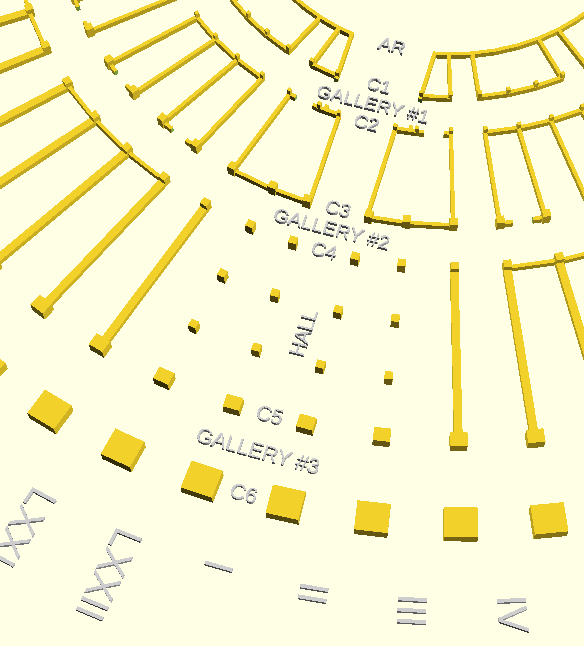
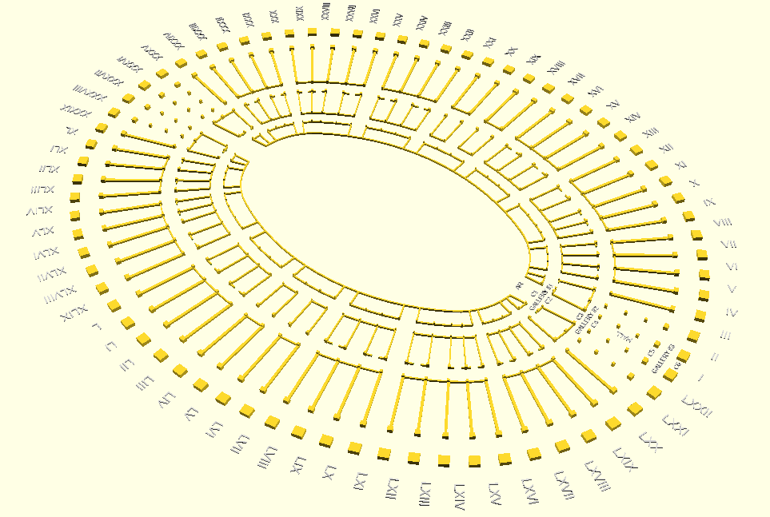

# Verona Arena
### 2 - Building the plan of the model

Once defined the procedure to build the outermost oval, it is trivial to add the inner ones, just reducing the radius of each arc of circle. But an anomaly immediately appears: add internal ovals drawing their perimeters at constant distance from external one causes a progressive flattening of the ovals. And this creates a problem for our procedural building: arches of the outermost ovals are of the same size because of our construction, but their projections on internal ovals presents a different size either on smaller or bigger arc of circle. There is no solution to this mismatch, this is also in the actual building, so we live with it and we stick with perfect match only on the outermost oval, the visibile one. The only impact on our procedural building is that, for inner ovals, we would need arches of slightly different size depending on the arc of circle they belong.

In order to proceed with the construction of inner ovals, my first approach is to print the plan and measure the distances between ovals with the ruler, then to apply a proportional reduction to RMAX and Rmin in order to obtain their value for each of the inner oval. The final result was acceptable but I tried another way: the work of Prof. Trevisan makes ofteb reference to the "roman foot" as the unit of measure used for the roman buildings and in fact most sizes of the Arena are whole multiples of a "roman foot", included the two inner and outer axis.

- Outermost oval
  - AMAX = 259 roman feet
  - Amin = 209 roman feet
- Innermost oval
  - AMAX = 125 roman feet
  - Amin = 75 roman feet

Then first (good) thing we note is that the distance between outermost and innermost ovals is constantly 134 roman feet, a necessary condition for building an amphitheatre with terraces of cnstant width and height. This approach seemed to fit very well for the procedural building, so I proceeded to determine the radius for the other inner ovals, hoping for a whole number of roman feet.

This is the list of ovals we need:
- Arena : innermost oval
- Wall-1 : 1st intermediate wall
- Circle-1 : 1st oval of columns
- Gallery-1 : 1st gallery
- Circle-2 : 2nd oval of columns
- Wall-2 : 2nd intermediate wall
- Circle-3 : 3rd oval of columns
- Gallery-2 : 2nd gallery
- Circle-4 : 4th oval of columns
- Wall-3 : 3rd intermediate wall
- Circle-5 : 5th oval of columns
- Gallery-3 : 3rd gallery
- Circle-6 : 6th oval of columns

Considering that the "roman feet" is about 0.2954 meters, the final sizes are the following (for significant values there is radius at the border and in the middle, in order to make procedural positioning easier):

|             | DELTA |             | AMAX  | border   | middle   | AMIN  | border   | middle | 
|-------------|-------|-------------|-------|----------|----------|-------|----------|--------|
|             | ft    | mt          | ft    | mt       | mt       | ft    | mt       | mt     | 
| arena       |       |             | 125   | 36.925   |          | 75    | 22.155   |        | 
| 1st wall    | 13    | 3.840       | 138   | 40.765   |          | 88    | 25.995   |        | 
| 1st circle  | 1     | 0.295       | 139   | 41.061   | 40.913   | 89    | 26.291   | 26.143 | 
| 1st gallery | 10    | 2.954       | 149   | 44.015   | 42.538   | 99    | 29.245   | 27.768 | 
| 2nd circle  | 1     | 0.295       | 150   | 44.310   | 44.162   | 100   | 29.540   | 29.392 | 
| 2nd wall    | 26    | 7.680       | 176   | 51.990   |          | 126   | 37.220   |        | 
| 3rd circle  | 1     | 0.295       | 177   | 52.286   | 52.138   | 127   | 37.516   | 37.368 | 
| 2nd gallery | 11    | 3.249       | 188   | 55.535   | 53.911   | 138   | 40.765   | 39.141 | 
| 4th circle  | 2     | 0.591       | 190   | 56.126   | 55.831   | 140   | 41.356   | 41.061 | 
| 3rd wall    | 43    | 12.702      | 233   | 68.828   |          | 183   | 54.058   |        | 
| 5th circle  | 4     | 1.182       | 237   | 70.010   | 69.419   | 187   | 55.240   | 54.649 | 
| 3rd gallery | 15    | 4.431       | 252   | 74.441   | 72.225   | 202   | 59.671   | 57.455 | 
| 6th circle  | 7     | 2.068       | 259   | 76.509   | 75.475   | 209   | 61.739   | 60.705 | 

It is worth noting that using whole numbers in "roman feet" for the intermediate sizes leads to final values slightly different from the ones available in the public domain, but I found them closer to the spirit of the builder, so I decided to use them.

As previously anticipated, the system of equations has been solved in order to have arches of the 3rd gallery equal in size, and results necessary to draw the for-centers-oval are the following:
- alpha = 59.4 °
- RMAX = 94.023 m
- Rmin = 54.113 m

The size of arches for arcs of circle of each ovals are calculated. Now it seems just a curiosity, but it will be fundamental in the procedural building of the model, because arches of each inner ovals need to be carefully sized. As expected, the arches of the outermost ovals are almost identical on the two arcs of circle (both with RMAX and Rmin), while the mismatch grows progressively going internally until the maximum mismatch on the innermost ovals (but here we do not have architectural geometries that could be aesthetically compromised).
 
|             | LMAX  | LMIN     | LMAX  | LMIN   |
|-------------|-------|----------|-------|--------|
|             | mt    | mt       | mt    | mt     |
| arena       | 3.552 | 1.811    |       |        |
| 1st wall    | 3.793 | 2.230    |       |        |
| 1st circle  | 3.812 | 2.262    | 3.803 | 2.246  |
| 1st gallery | 3.998 | 2.584    | 3.905 | 2.423  |
| 2nd circle  | 4.016 | 2.617    | 4.007 | 2.601  |
| 2nd wall    | 4.499 | 3.455    |       |        |
| 3rd circle  | 4.517 | 3.487    | 4.508 | 3.471  |
| 2nd gallery | 4.722 | 3.842    | 4.619 | 3.664  |
| 4th circle  | 4.759 | 3.906    | 4.740 | 3.874  |
| 3rd wall    | 5.557 | 5.292    |       |        |
| 5th circle  | 5.631 | 5.421    | 5.594 | 5.357  |
| 3rd gallery | 5.908 | 5.905    | 5.770 | 5.663  |
| 6th circle  | 6.039 | 6.130    | 5.974 | 6.018  |
|             | border|          | middle|        |


Now we have all the parameters necessary to draw the complete plan in openSCAD, iterating the same procedure seen in previous file, for each oval composed by four arcs of circle with radius RMAX and Rmin.

```
   // oval radius
   rmaxar = [56.535];                  // arena
   rmax1c = [60.375,60.523,60.671];    // column 1
   rmaxg1 = [62.148];                  // gallery 1
   rmax2c = [63.625,63.772,63.920];    // column 2
   rmax3c = [71.600,71.748,71.896];    // column 3
   rmaxg2 = [73.521];                  // gallery 2
   rmax4c = [75.145,75.441,75.736];    // column 4
   rmax5c = [88.438,89.029,89.620];    // column 5
   rmaxg3 = [91.835];                  // gallery 3
   rmax6c = [94.023,95.085,96.119];    // column 6
   rminar = [16.593];
   rmin1c = [20.433,20.581,20.728];
   rming1 = [22.205];
   rmin2c = [23.682,23.830,23.978];
   rmin3c = [31.658,31.806,31.954];
   rming2 = [33.578];
   rmin4c = [35.203,35.498,35.794];
   rmin5c = [48.496,49.087,49.678];
   rming3 = [51.893];
   rmin6c = [54.113,55.142,56.176];

   // arena oval parameters
   alfa = 59.4;
   beta = 90 - alfa;
   dx = (rmax6c[1]-rmin6c[1])*cos(alfa);
   dy = (rmax6c[1]-rmin6c[1])*sin(alfa);
```

A quick explanation of procedural building: the outermost oval is composed by 2.1 x 2.3 m columns at radius RMAX6C[1] and RMIN6C[1]. The same for the other inner ovals, but progressively reducing size of columns. Wherever present, walls are drawn along the ovals and along radius. Special cases are the two halls, which have columns not oriented along radii, but aligned with external ones in order to have rectangular shape.

Here below the final result and zoom of hall:






```openscad
// oval radius
rmaxar = [56.535];                  // arena
rmax1c = [60.375,60.523,60.671];    // column 1
rmaxg1 = [62.148];                  // galley 1
rmax2c = [63.625,63.772,63.920];    // column 2
rmax3c = [71.600,71.748,71.896];    // column 3
rmaxg2 = [73.521];                  // gallery 2
rmax4c = [75.145,75.441,75.736];    // column 4
rmax5c = [88.438,89.029,89.620];    // column 5
rmaxg3 = [91.835];                  // gallery 3
rmax6c = [94.023,95.085,96.119];    // column 6

rminar = [16.593];
rmin1c = [20.433,20.581,20.728];
rming1 = [22.205];
rmin2c = [23.682,23.830,23.978];
rmin3c = [31.658,31.806,31.954];
rming2 = [33.578];
rmin4c = [35.203,35.498,35.794];
rmin5c = [48.496,49.087,49.678];
rming3 = [51.893];
rmin6c = [54.113,55.142,56.176];

// arena oval parameters
alfa = 59.4;
beta = 90 - alfa;
dx = (rmax6c[1]-rmin6c[1])*cos(alfa);
dy = (rmax6c[1]-rmin6c[1])*sin(alfa);

// uncomment to show legend
color("LightGray") show_legend();

// COLUMN 6
for (ii=[-9:9]) {
  theta = alfa*(2*ii+1)/19;
  px = (rmin6c[1])*cos(theta);
  py = (rmin6c[1])*sin(theta);
  translate([px+dx,py,0])   rotate([0,0,theta])  rect([2.1,2.3,1]);
  translate([px+dx,-py,0])  rotate([0,0,-theta]) rect([2.1,2.3,1]);
  translate([-px-dx,py,0])  rotate([0,0,-theta]) rect([2.1,2.3,1]);
  translate([-px-dx,-py,0]) rotate([0,0,theta])  rect([2.1,2.3,1]);
}

for (jj=[0:7]) {
  theta = (90-alfa)*(2*jj+1)/17;
  px = (rmax6c[1])*cos(theta+90);
  py = (rmax6c[1])*sin(theta+90);
  translate([-px,py-dy,0])  rotate([0,0,-theta+90]) rect([2.1,2.3,1]);
  translate([px,py-dy,0])   rotate([0,0,theta+90])  rect([2.1,2.3,1]);
  translate([-px,-py+dy,0]) rotate([0,0,theta+90])  rect([2.1,2.3,1]);
  translate([px,-py+dy,0])  rotate([0,0,-theta+90]) rect([2.1,2.3,1]);
}

// COLUMN 5
for (ii=[0:9]) {
  theta = alfa*(2*ii+1)/19;
  px = (rmin5c[1])*cos(theta);
  py = (rmin5c[1])*sin(theta);
  if (ii>0) translate([px+dx,py,0])   rotate([0,0,theta])  rect([1,1.2,1]);
  if (ii>0) translate([px+dx,-py,0])  rotate([0,0,-theta]) rect([1,1.2,1]);
  if (ii>0) translate([-px-dx,py,0])  rotate([0,0,-theta]) rect([1,1.2,1]);
  if (ii>0) translate([-px-dx,-py,0]) rotate([0,0,theta])  rect([1,1.2,1]);
}

for (jj=[0:7]) {
  theta = (90-alfa)*(2*jj+1)/17;
  px = (rmax5c[1])*cos(theta+90);
  py = (rmax5c[1])*sin(theta+90);
  translate([-px,py-dy,0])  rotate([0,0,-theta+90]) rect([1,1.2,1]);
  translate([px,py-dy,0])   rotate([0,0,theta+90])  rect([1,1.2,1]);
  translate([-px,-py+dy,0]) rotate([0,0,theta+90])  rect([1,1.2,1]);
  translate([px,-py+dy,0])  rotate([0,0,-theta+90]) rect([1,1.2,1]);
}

// WALL 5-4
for (ii=[0:9]) {
  theta = alfa*(2*ii+1)/19;
  px = 0.5*(rmin5c[1]+rmin4c[1])*cos(theta);
  py = 0.5*(rmin5c[1]+rmin4c[1])*sin(theta);
  if (ii==1) { // second wall after hall is column only, first is hall
    px2 = ((2*rmin5c[1]+rmin4c[1])/3)*cos(theta);
    py2 = ((2*rmin5c[1]+rmin4c[1])/3)*sin(theta);
    translate([px2+dx,py2,0])   rotate([0,0,theta])  rect([0.6,0.6,1]);
    translate([px2+dx,-py2,0])  rotate([0,0,-theta]) rect([0.6,0.6,1]);
    translate([-px2-dx,py2,0])  rotate([0,0,-theta]) rect([0.6,0.6,1]);
    translate([-px2-dx,-py2,0]) rotate([0,0,theta])  rect([0.6,0.6,1]);
    px3 = ((rmin5c[1]+2*rmin4c[1])/3)*cos(theta);
    py3 = ((rmin5c[1]+2*rmin4c[1])/3)*sin(theta);
    translate([px3+dx,py3,0])   rotate([0,0,theta])  rect([0.6,0.6,1]);
    translate([px3+dx,-py3,0])  rotate([0,0,-theta]) rect([0.6,0.6,1]);
    translate([-px3-dx,py3,0])  rotate([0,0,-theta]) rect([0.6,0.6,1]);
    translate([-px3-dx,-py3,0]) rotate([0,0,theta])  rect([0.6,0.6,1]);
  }
  if (ii>1) { // walls start at third wall
    translate([px+dx,py,0])   rotate([0,0,theta+90])  rect([0.6,13.5,0.5]);
    translate([px+dx,-py,0])  rotate([0,0,-theta+90]) rect([0.6,13.5,0.5]);
    translate([-px-dx,py,0])  rotate([0,0,-theta+90]) rect([0.6,13.5,0.5]);
    translate([-px-dx,-py,0]) rotate([0,0,theta+90])  rect([0.6,13.5,0.5]);
  }
}

for (jj=[0:7]) {
  theta = (90-alfa)*(2*jj+1)/17;
  px = 0.5*(rmax5c[1]+rmax4c[1])*cos(theta+90);
  py = 0.5*(rmax5c[1]+rmax4c[1])*sin(theta+90);
  translate([-px,py-dy,0])  rotate([0,0,-theta]) rect([0.6,13.5,0.5]);
  translate([px,py-dy,0])   rotate([0,0,theta])  rect([0.6,13.5,0.5]);
  translate([-px,-py+dy,0]) rotate([0,0,theta])  rect([0.6,13.5,0.5]);
  translate([px,-py+dy,0])  rotate([0,0,-theta]) rect([0.6,13.5,0.5]);
}

// COLUMN 4
for (ii=[0:9]) {
  theta = alfa*(2*ii+1)/19;
  px = (rmin4c[1])*cos(theta);
  py = (rmin4c[1])*sin(theta);
  if (ii>0) { // first column is excluded because hall
    translate([px+dx,py,0])   rotate([0,0,theta])  rect([0.6,0.6,1]);
    translate([px+dx,-py,0])  rotate([0,0,-theta]) rect([0.6,0.6,1]);
    translate([-px-dx,py,0])  rotate([0,0,-theta]) rect([0.6,0.6,1]);
    translate([-px-dx,-py,0]) rotate([0,0,theta])  rect([0.6,0.6,1]);
  }
}

for (jj=[0:7]) {
  theta = (90-alfa)*(2*jj+1)/17;
  px = (rmax4c[1])*cos(theta+90);
  py = (rmax4c[1])*sin(theta+90);
  translate([-px,py-dy,0])  rotate([0,0,-theta+90]) rect([0.6,0.6,1]);
  translate([px,py-dy,0])   rotate([0,0,theta+90])  rect([0.6,0.6,1]);
  translate([-px,-py+dy,0]) rotate([0,0,theta+90])  rect([0.6,0.6,1]);
  translate([px,-py+dy,0])  rotate([0,0,-theta+90]) rect([0.6,0.6,1]);
}

// COLUMN 3
for (ii=[0:9]) {
  theta = alfa*(2*ii+1)/19;
  px = (rmin3c[1])*cos(theta);
  py = (rmin3c[1])*sin(theta);
  if (ii>0) { // first column is excluded because hall
    translate([px+dx,py,0])   rotate([0,0,theta])  rect([0.6,0.6,1]);
    translate([px+dx,-py,0])  rotate([0,0,-theta]) rect([0.6,0.6,1]);
    translate([-px-dx,py,0])  rotate([0,0,-theta]) rect([0.6,0.6,1]);
    translate([-px-dx,-py,0]) rotate([0,0,theta])  rect([0.6,0.6,1]);
  }
}

for (jj=[0:7]) {
  theta = (90-alfa)*(2*jj+1)/17;
  px = (rmax3c[1])*cos(theta+90);
  py = (rmax3c[1])*sin(theta+90);
  translate([-px,py-dy,0])  rotate([0,0,-theta+90]) rect([0.6,0.6,1]);
  translate([px,py-dy,0])   rotate([0,0,theta+90])  rect([0.6,0.6,1]);
  translate([-px,-py+dy,0]) rotate([0,0,theta+90])  rect([0.6,0.6,1]);
  translate([px,-py+dy,0])  rotate([0,0,-theta+90]) rect([0.6,0.6,1]);
}

// WALL 3-2
for (ii=[0:9]) {
  theta = alfa*(2*ii+1)/19;
  px = 0.5*(rmin3c[1]+rmin2c[1])*cos(theta);
  py = 0.5*(rmin3c[1]+rmin2c[1])*sin(theta);
  if (ii>1) { // first is hall, second is skipped
    translate([px+dx,py,0])   rotate([0,0,theta+90])  rect([0.3,8,0.5]);
    translate([px+dx,-py,0])  rotate([0,0,-theta+90]) rect([0.3,8,0.5]);
    translate([-px-dx,py,0])  rotate([0,0,-theta+90]) rect([0.3,8,0.5]);
    translate([-px-dx,-py,0]) rotate([0,0,theta+90])  rect([0.3,8,0.5]);
  }
}

for (jj=[0:7]) {
  theta = (90-alfa)*(2*jj+1)/17;
  px = 0.5*(rmax3c[1]+rmax2c[1])*cos(theta+90);
  py = 0.5*(rmax3c[1]+rmax2c[1])*sin(theta+90);
  translate([-px,py-dy,0])  rotate([0,0,-theta]) rect([0.3,8,0.5]);
  translate([px,py-dy,0])   rotate([0,0,theta])  rect([0.3,8,0.5]);
  translate([-px,-py+dy,0]) rotate([0,0,theta])  rect([0.3,8,0.5]);
  translate([px,-py+dy,0])  rotate([0,0,-theta]) rect([0.3,8,0.5]);
}

// COLUMN 2
for (ii=[0:9]) {
  theta = alfa*(2*ii+1)/19;
  px = (rmin2c[1])*cos(theta);
  py = (rmin2c[1])*sin(theta);
  if (ii>0) { // first is skipped because hall
    translate([px+dx,py,0])   rotate([0,0,theta])  rect([0.3,0.3,1]);
    translate([px+dx,-py,0])  rotate([0,0,-theta]) rect([0.3,0.3,1]);
    translate([-px-dx,py,0])  rotate([0,0,-theta]) rect([0.3,0.3,1]);
    translate([-px-dx,-py,0]) rotate([0,0,theta])  rect([0.3,0.3,1]);
  }
}

for (jj=[0:7]) {
  theta = (90-alfa)*(2*jj+1)/17;
  px = (rmax2c[1])*cos(theta+90);
  py = (rmax2c[1])*sin(theta+90);
  translate([-px,py-dy,0])  rotate([0,0,-theta+90]) rect([0.3,0.3,1]);
  translate([px,py-dy,0])   rotate([0,0,theta+90])  rect([0.3,0.3,1]);
  translate([-px,-py+dy,0]) rotate([0,0,theta+90])  rect([0.3,0.3,1]);
  translate([px,-py+dy,0])  rotate([0,0,-theta+90]) rect([0.3,0.3,1]);
}

// COLUMN 1
for (ii=[0:9]) {
  theta = alfa*(2*ii+1)/19;
  px = (rmin1c[1])*cos(theta);
  py = (rmin1c[1])*sin(theta);
  if (ii>1) { // first is skipped, second is arena hall
    translate([px+dx,py,0])   rotate([0,0,theta])  rect([0.3,0.3,1]);
    translate([px+dx,-py,0])  rotate([0,0,-theta]) rect([0.3,0.3,1]);
    translate([-px-dx,py,0])  rotate([0,0,-theta]) rect([0.3,0.3,1]);
    translate([-px-dx,-py,0]) rotate([0,0,theta])  rect([0.3,0.3,1]);
  }
}

for (jj=[0:7]) {
  theta = (90-alfa)*(2*jj+1)/17;
  px = (rmax1c[1])*cos(theta+90);
  py = (rmax1c[1])*sin(theta+90);
  translate([-px,py-dy,0])  rotate([0,0,-theta+90]) rect([0.3,0.3,1]);
  translate([px,py-dy,0])   rotate([0,0,theta+90])  rect([0.3,0.3,1]);
  translate([-px,-py+dy,0]) rotate([0,0,theta+90])  rect([0.3,0.3,1]);
  translate([px,-py+dy,0])  rotate([0,0,-theta+90]) rect([0.3,0.3,1]);
}

// WALL 1-A
for (ii=[0:9]) {
  theta = alfa*(2*ii+1)/19;
  px = 0.5*(rmin1c[1]+rminar[0])*cos(theta);
  py = 0.5*(rmin1c[1]+rminar[0])*sin(theta);
  if ((ii==2)||(ii==3)||(ii==6)||(ii==7)) { // only some walls present
    translate([px+dx,py,0])   rotate([0,0,theta+90])  rect([0.3,4,0.5]);
    translate([px+dx,-py,0])  rotate([0,0,-theta+90]) rect([0.3,4,0.5]);
    translate([-px-dx,py,0])  rotate([0,0,-theta+90]) rect([0.3,4,0.5]);
    translate([-px-dx,-py,0]) rotate([0,0,theta+90])  rect([0.3,4,0.5]);
  }
}

for (jj=[0:7]) {
  theta = (90-alfa)*(2*jj+1)/17;
  px = 0.5*(rmax1c[1]+rmaxar[0])*cos(theta+90);
  py = 0.5*(rmax1c[1]+rmaxar[0])*sin(theta+90);
  if ((jj==1)||(jj==2)||(jj==5)||(jj==6)) { // only some walls present
    translate([-px,py-dy,0])  rotate([0,0,-theta]) rect([0.3,4,0.5]);
    translate([px,py-dy,0])   rotate([0,0,theta])  rect([0.3,4,0.5]);
    translate([-px,-py+dy,0]) rotate([0,0,theta])  rect([0.3,4,0.5]);
    translate([px,-py+dy,0])  rotate([0,0,-theta]) rect([0.3,4,0.5]);
  }
}

// HALL
for (ii=[0:0]) { // hall columns and walls are parallel from first column 6 (not radial)
  theta = alfa*(2*ii+1)/19;
  px = (rmin5c[1])*cos(theta);
  py = (rmin5c[1])*sin(theta);
  translate([px+dx,py,0])   rotate([0,0,0]) rect([1,1.2,1]);
  translate([px+dx,-py,0])  rotate([0,0,0]) rect([1,1.2,1]);
  translate([-px-dx,py,0])  rotate([0,0,0]) rect([1,1.2,1]);
  translate([-px-dx,-py,0]) rotate([0,0,0]) rect([1,1.2,1]);
  px2 = ((2*rmin5c[1]+rmin4c[1])/3)*cos(theta);
  translate([px2+dx,py-0.3,0])   rotate([0,0,0]) rect([0.6,0.6,1]);
  translate([px2+dx,-py+0.3,0])  rotate([0,0,0]) rect([0.6,0.6,1]);
  translate([-px2-dx,py-0.3,0])  rotate([0,0,0]) rect([0.6,0.6,1]);
  translate([-px2-dx,-py+0.3,0]) rotate([0,0,0]) rect([0.6,0.6,1]);
  px3 = ((rmin5c[1]+2*rmin4c[1])/3)*cos(theta);
  translate([px3+dx,py-0.3,0])   rotate([0,0,0]) rect([0.6,0.6,1]);
  translate([px3+dx,-py+0.3,0])  rotate([0,0,0]) rect([0.6,0.6,1]);
  translate([-px3-dx,py-0.3,0])  rotate([0,0,0]) rect([0.6,0.6,1]);
  translate([-px3-dx,-py+0.3,0]) rotate([0,0,0]) rect([0.6,0.6,1]);
  px4 = (rmin4c[1])*cos(theta);
  translate([px4+dx,py-0.3,0])   rotate([0,0,0]) rect([0.6,0.6,1]);
  translate([px4+dx,-py+0.3,0])  rotate([0,0,0]) rect([0.6,0.6,1]);
  translate([-px4-dx,py-0.3,0])  rotate([0,0,0]) rect([0.6,0.6,1]);
  translate([-px4-dx,-py+0.3,0]) rotate([0,0,0]) rect([0.6,0.6,1]);
  px5 = (rmin3c[1])*cos(theta);
  translate([px5+dx,py-0.3,0])   rotate([0,0,0]) rect([0.6,0.6,1]);
  translate([px5+dx,-py+0.3,0])  rotate([0,0,0]) rect([0.6,0.6,1]);
  translate([-px5-dx,py-0.3,0])  rotate([0,0,0]) rect([0.6,0.6,1]);
  translate([-px5-dx,-py+0.3,0]) rotate([0,0,0]) rect([0.6,0.6,1]);
  px6 = ((rmin3c[1]+rmin2c[1])/2)*cos(theta);
  translate([px6+dx,py-0.45,0])   rotate([0,0,90]) rect([0.3,8,0.5]);
  translate([px6+dx,-py+0.45,0])  rotate([0,0,90]) rect([0.3,8,0.5]);
  translate([-px6-dx,py-0.45,0])  rotate([0,0,90]) rect([0.3,8,0.5]);
  translate([-px6-dx,-py+0.45,0]) rotate([0,0,90]) rect([0.3,8,0.5]);
  px7 = (rmin2c[1])*cos(theta);
  translate([px7+dx,py-0.45,0])   rotate([0,0,0]) rect([0.3,0.3,1]);
  translate([px7+dx,-py+0.45,0])  rotate([0,0,0]) rect([0.3,0.3,1]);
  translate([-px7-dx,py-0.45,0])  rotate([0,0,0]) rect([0.3,0.3,1]);
  translate([-px7-dx,-py+0.45,0]) rotate([0,0,0]) rect([0.3,0.3,1]);
}

// ARENA HALL
for (ii=[1:1]) { // arena columns and walls are parallel from column 1 (not radial)
  theta = alfa*(2*ii+1)/19;
  px = (rmin1c[1])*cos(theta);
  py = (rmin1c[1])*sin(theta);
  translate([px+dx,py,0])   rotate([0,0,0]) rect([0.3,0.3,1]);
  translate([px+dx,-py,0])  rotate([0,0,0]) rect([0.3,0.3,1]);
  translate([-px-dx,py,0])  rotate([0,0,0]) rect([0.3,0.3,1]);
  translate([-px-dx,-py,0]) rotate([0,0,0]) rect([0.3,0.3,1]);
  px2 = ((rmin1c[1]+rminar[0])/2-0.1)*cos(theta);
  translate([px2+dx,py,0])   rotate([0,0,90]) rect([0.3,4.2,0.5]);
  translate([px2+dx,-py,0])  rotate([0,0,90]) rect([0.3,4.2,0.5]);
  translate([-px2-dx,py,0])  rotate([0,0,90]) rect([0.3,4.2,0.5]);
  translate([-px2-dx,-py,0]) rotate([0,0,90]) rect([0.3,4.2,0.5]);
  px3 = ((rmin2c[1]+rmin1c[1])/2)*cos(theta);
  translate([px3+dx,py,0])   rotate([0,0,90]) door([0.3,3.2,0.5],2.5);
  translate([px3+dx,-py,0])  rotate([0,0,90]) door([0.3,3.2,0.5],2.5);
  translate([-px3-dx,py,0])  rotate([0,0,90]) door([0.3,3.2,0.5],2.5);
  translate([-px3-dx,-py,0]) rotate([0,0,90]) door([0.3,3.2,0.5],2.5);
}

// SEGMENTS rmin oval
for (ii=[-9:9]) {
  theta = (alfa*2*ii)/19;
  px = (rmin4c[1])*cos(theta);
  py = (rmin4c[1])*sin(theta);
  if ((abs(ii)==4)||(abs(ii)==5)||(abs(ii)==6)||(abs(ii)==8)||(abs(ii)==9)) {
    translate([px+dx,py,0])   rotate([0,0,theta])  rect([0.3,4,0.5]);
    translate([-px-dx,py,0])  rotate([0,0,-theta]) rect([0.3,4,0.5]);
  }
  px2 = (rmin3c[1])*cos(theta);
  py2 = (rmin3c[1])*sin(theta);
  if (abs(ii)==1) {
    translate([px2+dx,py2,0])   rotate([0,0,theta])  translate([0,0.25*ii,0]) rect([0.3,3,0.5]);
    translate([-px2-dx,py2,0])  rotate([0,0,-theta]) translate([0,0.25*ii,0]) rect([0.3,3,0.5]);
  }
  if (abs(ii)==2) {
    translate([px2+dx,py2,0])   rotate([0,0,theta])  rect([0.3,3.5,0.5]);
    translate([-px2-dx,py2,0])  rotate([0,0,-theta]) rect([0.3,3.5,0.5]);
  }
  if ((abs(ii)==4)||(abs(ii)==6)||(abs(ii)==8)||(abs(ii)==9)) {
    translate([px2+dx,py2,0])   rotate([0,0,theta])  door([0.3,3.5,0.5],1.5);
    translate([-px2-dx,py2,0])  rotate([0,0,-theta]) door([0.3,3.5,0.5],1.5);
  }
  px3 = (rmin2c[1])*cos(theta);
  py3 = (rmin2c[1])*sin(theta);
  if (abs(ii)==1) {
    translate([px3+dx,py3,0])   rotate([0,0,theta])  translate([0,0.5*ii,0])  rect([0.3,1.5,0.5]);
    translate([-px3-dx,py3,0])  rotate([0,0,-theta]) translate([0,0.5*ii,0])  rect([0.3,1.5,0.5]);
  }
  if (abs(ii)==2) {
    translate([px3+dx,py3,0])   rotate([0,0,theta])  door([0.3,2.5,0.5],1.5);
    translate([-px3-dx,py3,0])  rotate([0,0,-theta]) door([0.3,2.5,0.5],1.5);
  }
  if ((abs(ii)==4)||(abs(ii)==5)||(abs(ii)==6)||(abs(ii)==8)||(abs(ii)==9)) {
    translate([px3+dx,py3,0])   rotate([0,0,theta])  rect([0.3,2.5,0.5]);
    translate([-px3-dx,py3,0])  rotate([0,0,-theta]) rect([0.3,2.5,0.5]);
  }
  px4 = (rmin1c[1])*cos(theta);
  py4 = (rmin1c[1])*sin(theta);
  if ((abs(ii)==2)||(abs(ii)==4)||(abs(ii)==5)||(abs(ii)==6)||(abs(ii)==8)||(abs(ii)==9)) {
    translate([px4+dx,py4,0])   rotate([0,0,theta])  rect([0.3,2.2,0.5]);
    translate([-px4-dx,py4,0])  rotate([0,0,-theta]) rect([0.3,2.2,0.5]);
  }
  px5 = (rminar[0])*cos(theta);
  py5 = (rminar[0])*sin(theta);
  if (abs(ii)>2) {
    translate([px5+dx,py5,0])   rotate([0,0,theta])  rect([0.3,1.9,0.5]);
    translate([-px5-dx,py5,0])  rotate([0,0,-theta]) rect([0.3,1.9,0.5]);
  }
  if (abs(ii)==2) {
    translate([px5+dx,py5,0])   rotate([0,0,theta])  translate([0,0.3*ii/abs(ii),0]) rect([0.3,1.3,0.5]);
    translate([-px5-dx,py5,0])  rotate([0,0,-theta]) translate([0,0.3*ii/abs(ii),0]) rect([0.3,1.3,0.5]);
  }
}


// SEGMENTS rmax oval
for (jj=[-8:8]) {
  theta = ((90-alfa)*2*jj)/17;
  px = (rmax4c[1])*cos(theta+90);
  py = (rmax4c[1])*sin(theta+90);  
  if ((abs(jj)==1)||(abs(jj)==3)||(abs(jj)==4)||(abs(jj)==5)||(abs(jj)==7)||(abs(jj)==8)) {
    translate([px,py-dy,0])  rotate([0,0,theta+90])  rect([0.3,5,0.5]);
    translate([px,-py+dy,0]) rotate([0,0,-theta+90]) rect([0.3,5,0.5]);
  }
  px2 = (rmax3c[1])*cos(theta+90);
  py2 = (rmax3c[1])*sin(theta+90);  
  if ((abs(jj)==3)||(abs(jj)==5)||(abs(jj)==7)) {
    translate([px2,py2-dy,0])  rotate([0,0,theta+90])  door([0.3,4,0.5],1.5);
    translate([px2,-py2+dy,0]) rotate([0,0,-theta+90]) door([0.3,4,0.5],1.5);
  }
  px3 = (rmax2c[1])*cos(theta+90);
  py3 = (rmax2c[1])*sin(theta+90);  
  if ((abs(jj)==1)||(abs(jj)==3)||(abs(jj)==4)||(abs(jj)==5)||(abs(jj)==7)||(abs(jj)==8)) {
    translate([px3,py3-dy,0])  rotate([0,0,theta+90])  rect([0.3,4,0.5]);
    translate([px3,-py3+dy,0]) rotate([0,0,-theta+90]) rect([0.3,4,0.5]);
  }
  px4 = (rmax1c[1])*cos(theta+90);
  py4 = (rmax1c[1])*sin(theta+90);  
  if ((abs(jj)==0)||(abs(jj)==1)||(abs(jj)==3)||(abs(jj)==4)||(abs(jj)==5)||(abs(jj)==7)||(abs(jj)==8)) {
    translate([px4,py4-dy,0])  rotate([0,0,theta+90])  rect([0.3,4,0.5]);
    translate([px4,-py4+dy,0]) rotate([0,0,-theta+90]) rect([0.3,4,0.5]);
  }
  px5 = (rmaxar[0])*cos(theta+90);
  py5 = (rmaxar[0])*sin(theta+90);  
  translate([px5,py5-dy,0])  rotate([0,0,theta+90])  rect([0.3,3.6,0.5]);
  translate([px5,-py5+dy,0]) rotate([0,0,-theta+90]) rect([0.3,3.6,0.5]);
}

// column or wall
module rect(ss) { 
  translate([-ss.x/2,-ss.y/2,0]) cube([ss.x,ss.y,ss.z]);
}

// door (wall with void)
module door(ss,oo) {
  if (ss.x>ss.y) difference() {
    translate([-ss.x/2,-ss.y/2,0]) cube([ss.x,ss.y,ss.z]);
    translate([-oo/2,-(ss.y*1.1)/2,-(ss.z*0.1)/2]) cube([oo,ss.y*1.1,ss.z*1.1]);
  }
  else difference() {
    translate([-ss.x/2,-ss.y/2,0]) cube([ss.x,ss.y,ss.z]);
    translate([-(ss.x*1.1)/2,-oo/2,-(ss.z*0.1)/2]) cube([ss.x*1.1,oo,ss.z*1.1]);
  }
}

// LEGEDN
module show_legend() {
  tminp = ["LXIV","LXV","LXVI","LXVII","LXVIII","LXIX","LXX","LXXI","LXXII","I","II","III","IV","V","VI","VII","VIII","IX","X"];
  tminn = ["XXVIII","XXIX","XXX","XXXI","XXXII","XXXIII","XXXIV","XXXV","XXXVI","XXXVII","XXXVIII","XXXIX","XL","XLI","XLII","XLIII","XLIV","XLV","XLVI"];
  for (ii=[-9:9]) {
    theta = (alfa*2*ii)/19;
    px = (rmin6c[2]+4)*cos(theta);
    py = (rmin6c[2]+4)*sin(theta);
    translate([px+dx,py,0]) rotate([0,0,theta]) translate([0,-1,0.5]) scale([1,1,0.3]) text(text=tminp[ii+9],size=2);
    translate([-px-dx,py,0]) rotate([0,0,180-theta]) translate([0,-1,0.5]) scale([1,1,0.3]) text(text=tminn[9-ii],size=2);
  }
  tmaxp = ["XI","XII","XIII","XIV","XV","XVI","XVII","XVIII","XIX","XX","XXI","XXII","XXIII","XXIV","XXV","XXVI","XXVII"];
  tmaxn = ["XLVII","XLVIII","XLIX","L","LI","LII","LIII","LIV","LV","LVI","LVII","LVIII","LIX","LX","LXI","LXII","LXIII"];
  for (jj=[-8:8]) {
    theta = ((90-alfa)*2*jj)/17;
    px = (rmax6c[2]+4)*cos(theta+90);
    py = (rmax6c[2]+4)*sin(theta+90);
    translate([px,py-dy,0]) rotate([0,0,theta+90])  translate([0,-1,0.5]) scale([1,1,0.3]) text(text=tmaxp[jj+8],size=2);
    translate([px,-py+dy,0]) rotate([0,0,270-theta])  translate([0,-1,0.5]) scale([1,1,0.3]) text(text=tmaxn[8-jj],size=2);
  }
  // other names
  theta = 0;
  px2 = (rming3[0]-0.5)*cos(theta);
  py2 = (rming3[0]-0.5)*sin(theta);
  translate([px2+dx,py2,0]) rotate([0,0,90])  translate([0,-1,0.5]) scale([1,1,0.3]) text(text="GALLERY #3",halign="center",size=1.1);
  px3 = (rming2[0]-0.5)*cos(theta);
  py3 = (rming2[0]-0.5)*sin(theta);
  translate([px3+dx,py3,0]) rotate([0,0,90])  translate([0,-1,0.5]) scale([1,1,0.3]) text(text="GALLERY #2",halign="center",size=1.1);
  px4 = (rming1[0]-0.5)*cos(theta);
  py4 = (rming1[0]-0.5)*sin(theta);
  translate([px4+dx,py4,0]) rotate([0,0,90])  translate([0,-1,0.5]) scale([1,1,0.3]) text(text="GALLERY #1",halign="center",size=1.1);
  pxa = (rminar[0]-0.5)*cos(theta);
  pya = (rminar[0]-0.5)*sin(theta);
  translate([pxa+dx,pya,0]) rotate([0,0,90])  translate([0,-1,0.5]) scale([1,1,0.3]) text(text="AR",halign="center",size=1.1);
  pxc1 = (rmin1c[0]-0.5)*cos(theta);
  pyc1 = (rmin1c[0]-0.5)*sin(theta);
  translate([pxc1+dx,pyc1,0]) rotate([0,0,90])  translate([0,-1,0.5]) scale([1,1,0.3]) text(text="C1",halign="center",size=1.1);
  pxc2 = (rmin2c[2]-0.5)*cos(theta);
  pyc2 = (rmin2c[2]-0.5)*sin(theta);
  translate([pxc2+dx,pyc2,0]) rotate([0,0,90])  translate([0,-1,0.5]) scale([1,1,0.3]) text(text="C2",halign="center",size=1.1);
  pxc3 = (rmin3c[1]-0.5)*cos(theta);
  pyc3 = (rmin3c[1]-0.5)*sin(theta);
  translate([pxc3+dx,pyc3,0]) rotate([0,0,90])  translate([0,-1,0.5]) scale([1,1,0.3]) text(text="C3",halign="center",size=1.1);
  pxc4 = (rmin4c[1]-0.5)*cos(theta);
  pyc4 = (rmin4c[1]-0.5)*sin(theta);
  translate([pxc4+dx,pyc4,0]) rotate([0,0,90])  translate([0,-1,0.5]) scale([1,1,0.3]) text(text="C4",halign="center",size=1.1);
  pxc5 = (rmin5c[1]-0.5)*cos(theta);
  pyc5 = (rmin5c[1]-0.5)*sin(theta);
  translate([pxc5+dx,pyc5,0]) rotate([0,0,90])  translate([0,-1,0.5]) scale([1,1,0.3]) text(text="C5",halign="center",size=1.1);
  pxc6 = (rmin6c[1]-0.5)*cos(theta);
  pyc6 = (rmin6c[1]-0.5)*sin(theta);
  translate([pxc6+dx,pyc6,0]) rotate([0,0,90])  translate([0,-1,0.5]) scale([1,1,0.3]) text(text="C6",halign="center",size=1.1);
  pxh = 0.5*(rmin5c[1]+rmin4c[1])*cos(theta);
  pyh = 0.5*(rmin5c[1]+rmin4c[1])*sin(theta);
  translate([pxh+dx,pyh,0]) rotate([0,0,180])  translate([0,-1,0.5]) scale([1,1,0.3]) text(text="HALL",halign="center",size=1.1);
}
```


