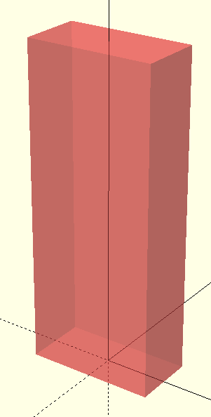
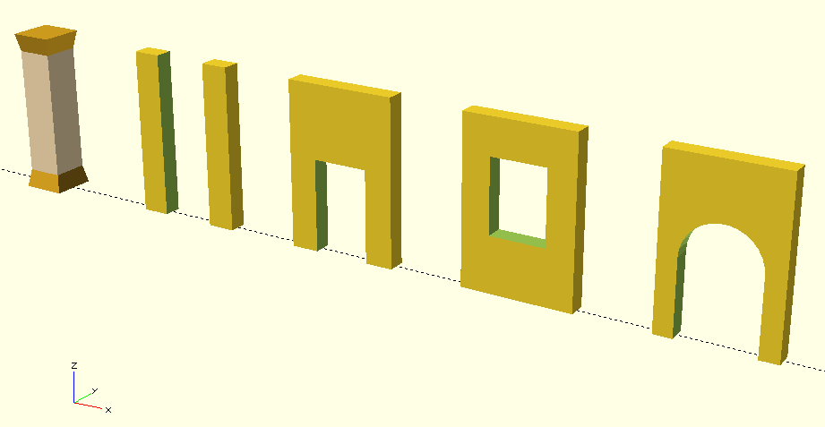
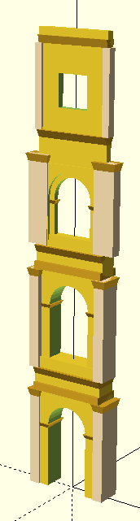
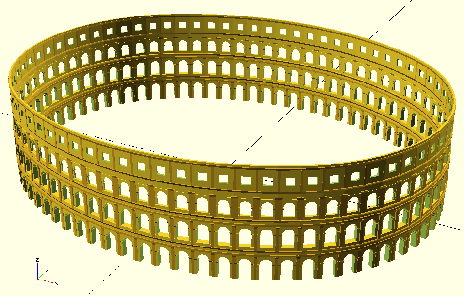

# Verona Arena
### 3 - Raising the outermost ring

Nel precedente articolo avevo concluso la costruzione della pianta dell'Arena di Verona partendo dalla costruzione originaria dell'ovale a quattro cerchi. La ricostruzione effettuata usando questo modello geometrico è sicuramente complessa e faticosa per un semplice disegno bidimensionale di una pianta, ma torna molto comodo adesso che devo erigere le pareti dell'edificio.

Quello che devo fare è disegnare gli elementi architettonici fondamentali dell'edificio (pareti, colonne, archi) e posizionarli dove indicato dal modello geometrico della pianta.


Elementi architettonici
arena verona elements coordinate system


Per ragioni che mi sono risultate evidenti in precedenti esperimenti, conviene disegnare gli elementi architettonici con un sistema di coordinate locali in cui l'origine degli assi è alla base dell'elemento per quanto riguarda l'asse Z e al centro geometrico per quanto riguarda gli assi X e Y.

La ragione è facile da spiegare facendo l'esempio di una colonna: il modello geometrico della pianta che ho sviluppato mi indica dove posizionare l'asse centrale della colonna sugli assi XY e la sua base sull'asse Z. Una volta posizionata, sarò libero di variarne le dimensioni delle basi e la sua altezza, perché non avranno alcun effetto sulla sua posizione. Viceversa, se avessi disegnato la colonna mettendo l'origine degli assi in uno dei vertici, variandone le dimensioni lungo X e Y avrei dovuto anche correggerne il posizionamento.


Questi sono gli elementi architettonici di base (e sotto il relativo codice openScad) che ho creato per cominciare ad erigere le pareti dell'Arena di Verona, salvo rimetterci mano in un secondo tempo per eventuali correzioni e aggiunta di dettagli.

Tutti sono disegnati con il sistema di coordinate locali sopra descritto e parametrici in modo da consentirne un ampio riutilizzo. L'aspetto positivo è che una volta posizionati tenendo conto delle dimensioni, possono essere modificati a piacimento rimanendo nello stesso inviluppo senza dover rimettere mano alla posizione stessa.

arena verona architectural elements


WALL : parallelepipedo, da usare come parete o colonna a base rettangolare.

// ss : vector for envelope cube
module wall(ss) { 
  translate([-ss.x/2,-ss.y/2,0]) cube([ss.x,ss.y,ss.z]);
}


TRAPEZOID : parallelepipedo trapezoidale, da usare come bordo sporgente o come capitello.

// ss : vector for envelope cube
// dx : displacement in X
// dx : displacement in Y
module trapezoid(ss,dx,dy) {
  points = [
    [-ss.x/2,-ss.y/2,0],[ss.x/2,-ss.y/2,0],[ss.x/2,ss.y/2,0],[-ss.x/2,ss.y/2,0],
    [-ss.x/2-dx,-ss.y/2-dy,ss.z],[ss.x/2+dx,-ss.y/2-dy,ss.z],
    [ss.x/2+dx,ss.y/2+dy,ss.z],[-ss.x/2-dx,ss.y/2+dy,ss.z]];
  faces = [
    [0,1,2,3],  // bottom
    [4,5,1,0],  // front
    [7,6,5,4],  // top
    [5,6,2,1],  // right
    [6,7,3,2],  // back
    [7,4,0,3]]; // left
  polyhedron(points,faces);
}


OPENING : parete con apertura per tutta l'altezza al centro

// ss : vector for envelope cube
// oo : opening width
module opening(ss,oo) {
  if (ss.x>ss.y) difference() {
    translate([-ss.x/2,-ss.y/2,0]) cube([ss.x,ss.y,ss.z]);
    translate([-oo/2,-(ss.y*1.1)/2,-(ss.z*0.1)/2]) cube([oo,ss.y*1.1,ss.z*1.1]);
  }
  else difference() {
    translate([-ss.x/2,-ss.y/2,0]) cube([ss.x,ss.y,ss.z]);
    translate([-(ss.x*1.1)/2,-oo/2,-(ss.z*0.1)/2]) cube([ss.x*1.1,oo,ss.z*1.1]);
  }
}


DOOR : parete con porta al centro

// ss : vector for envelope cube
// oo : door width
// hh : height of door
module door(ss,oo,hh) {
  if (ss.x>ss.y) difference() {
    translate([-ss.x/2,-ss.y/2,0]) cube([ss.x,ss.y,ss.z]);
    translate([-oo/2,-(ss.y*1.1)/2,-hh*0.1]) cube([oo,ss.y*1.1,hh*1.1]);
  }
  else difference() {
    translate([-ss.x/2,-ss.y/2,0]) cube([ss.x,ss.y,ss.z]);
    translate([-(ss.x*1.1)/2,-oo/2,-hh*0.1]) cube([ss.x*1.1,oo,hh*1.1]);
  }
}


WINDOW : parete con finestra al centro

// ss : vector for envelope cube
// oo : window width
// h1 : height of bottom of window
// h2 : height of top of window
module window(ss,oo,h1,h2) { 
  if (ss.x>ss.y) difference() {
    translate([-ss.x/2,-ss.y/2,0]) cube([ss.x,ss.y,ss.z]);
    translate([-oo/2,-(ss.y*1.1)/2,h1]) cube([oo,ss.y*1.1,h2]);
  }
  else difference() {
    translate([-ss.x/2,-ss.y/2,0]) cube([ss.x,ss.y,ss.z]);
    translate([-(ss.x*1.1)/2,-oo/2,h1]) cube([ss.x*1.1,oo,h2]);
  }
}


ARCH : parete con arco al centro

// ss : vector for envelope cube
// oo : width of opening and arch diameter
// hh : height of opening including arch
module arch(ss,oo,hh) {
  ho = hh-oo/2;
  if (ss.x>ss.y) difference() {
    translate([-ss.x/2,-ss.y/2,0]) cube([ss.x,ss.y,ss.z]);
    translate([-oo/2,-(ss.y*1.1)/2,-ho*0.1]) cube([oo,ss.y*1.1,ho*1.1]);
    translate([0,-(ss.y*1.1)/2,ho]) rotate([-90,0,0]) cylinder(d=oo,h=ss.y*1.1,$fs=0.2);
  }
  else difference() {
    translate([-ss.x/2,-ss.y/2,0]) cube([ss.x,ss.y,ss.z]);
    translate([-(ss.x*1.1)/2,-oo/2,-ho*0.1]) cube([ss.x*1.1,oo,ho*1.1]);
    translate([-(ss.x*1.1)/2,0,ho]) rotate([0,90,0]) cylinder(d=oo,h=ss.x*1.1,$fs=0.2);
  }  
}


Costruzione del sesto anello dell'Arena di Verona

Creati gli strumenti di base per la costruzione di pareti, colonne ed archi, comincio a studiare come costruire il sesto anello dell'Arena. L'idea di base è quella di costruire un singolo "elemento spicchio" di facciata e sfruttando il modello geometrico della pianta copiarlo in tutti e 72 gli spicchi dell'arena. In questo spicchio andrò a costruire la parete dell'arco e l'architrave come linea retta, non come segmento di ovale della pianta. Questa approssimazione è del tutto ragionevole, anche perché è probabilmente quello che è stata fatto dai costruttori. Quindi, a livello operativo, creerò questo spicchio elementare come composto da quattro piani, i primi tre di archi e il quarto, del tutto assente nei quattro spicchi rimasti, ispirandomi al Colosseo fatto a finestre rettangolari.

Agli estremi dello spicchio ci sarebbero le colonne, i capitelli e tutto ciò che è strutturalmente collegato ad esse, ma pur potendo, decido di non includerle nello spicchio stesso. Il problema di questo tipo di soluzione risulterebbe evidente vedendo due siffatti spicchi uno a fianco all'altro: gli estremi delle pareti si raccorderebbero con un piccolo spigolo (causato dal fatto che sono due segmenti di retta con angolazione diversa), che nel caso delle colonne sarebbe oltremodo evidente ed antiestetico. Molto meglio costruire un "elemento colonna" a sé stante di dimensioni prefissate e copiarlo nelle 72 posizioni esatte dettate dal modello. Oltre a rendere la colonna così realizzata esteticamente perfetta, incidentalmente va anche a coprire il leggero spigolo dovuto al raccordo dei due spicchi.

Scelto l'approccio, scendo nel dettaglio: sfortunatamente del sesto anello dell'Arena rimane ben poco, solo quattro spicchi e con solo tre dei quattro piani originari, ma sono sufficienti a ricostruire un modello di questo tipo dato che si può ragionevolmente ritenere che fossero tutti uguali.

Come primo passo cerco tutte le dimensioni che mi occorrono:

    Per quanto riguarda le dimensioni orizzontali, la larghezza complessiva dello spicchio è data dal modello geometrico della pianta, mentre quelle dei dettagli interni (colonne, aperture ed archi) è agevolmente ricavabile dalle fotografie.
    Per quanto riguarda le profondità, viste le ridotte dimensioni in gioco, la fotografia laterale degli spicchi rimasti forniscono sufficienti suggerimenti per i valori da adottare.
    Per quanto riguarda le altezze, su wikipedia si trovano alcuni valori significativi (altezza totale e altezza dei tre ordini di archi), che associati alle fotografie permettono di intuire anche le dimensioni di altri dettagli. Per l'ultimo piano, 

Trovate le dimensioni principali, comincio a assemblare gli elementi architettonici definendo le dimensioni secondarie letteralmente ad occhio, e cioè aggiustandone i valori in modo da far coincidere la vista del modello con quella delle fotografie reali. Come accennato precedentemente, non mi preoccupo più di tanto del fatto che gli elementi architettonici sopra definiti sono un po' rozzi, perché una volta piazzati potranno essere arricchiti in un secondo momento con il solo vincolo di non alterarne le dimensioni massime.

Questi i due elementi ricostruiti e come appaiono uno affianco all'altro in openScad.


C6ARCH : Elemento spicchio di arco del sesto anello
arena verona sixth ring element
module c6arch() {
  // ground floor
  translate([0,0,0])       arch([6.2,1.8,10],3.6,7.1);
  translate([-2.425,0,5])  trapezoid([1.25,1.8,0.3],0.15,0.15);
  translate([2.425,0,5])   trapezoid([1.25,1.8,0.3],0.15,0.15);
  translate([0,0,8.1])     wall([6.2,2.3,0.6]);
  translate([0,0,9.4])     trapezoid([6.2,1.8,0.6],0,0.3);
  // first floor
  translate([0,0,10]) {
    translate([0,0,0])       arch([6.2,1.5,10],3.6,7.1);
    translate([0,0,0])       wall([6.2,1.8,0.9]);
    translate([-2.425,0,5])  trapezoid([1.25,1.5,0.3],0.15,0.15);
    translate([2.425,0,5])   trapezoid([1.25,1.5,0.3],0.15,0.15);
    translate([0,0,8.1])     wall([6.2,2.1,0.6]);
    translate([0,0,9.4])     trapezoid([6.2,1.5,0.6],0,0.3);
  }
  // second floor
  translate([0,-0.15,20]) {
    translate([0,0,0])         arch([6.2,0.45,9],3.3,5.55);
    translate([0,0,0])         arch([6.2,0.9,6.5],4.2,6);
    translate([0,0,0])         wall([6.2,0.8,0.9]);
    translate([-2.275,0,3.3])  trapezoid([1.25,0.45,0.3],0.15,0.15);
    translate([2.275,0,3.3])   trapezoid([1.25,0.45,0.3],0.15,0.15);
    translate([0,0,6.5])       wall([6.2,0.6,1.9]);
    translate([0,0,8.4])       trapezoid([6.2,0.6,0.6],0,0.3);
  }
  // third floor
  translate([0,-0.15,29]) {
    translate([0,0,0])     window([6.2,0.6,7.75],2.6,1.8,2.6);
    translate([0,0,6.55])  trapezoid([6.2,0.7,0.6],0,0.15);
  }
}


C6COLUMN : elemento colonna del sesto anello

module c6column() {
  // ground floor
  translate([0,0,0])     wall([0.9,2.1,8.1]);
  translate([0,0,7.5])   trapezoid([0.9,2.1,0.6],0.15,0.15);
  // first floor
  translate([0,-0.25,10]) {
    translate([0,0,0])     wall([0.9,1.8,8.1]);
    translate([0,0,7.5])   trapezoid([0.9,1.8,0.6],0.15,0.15);
  }
  // second floor
  translate([0,-0.25,20]) {
    translate([0,0,0])     wall([1.8,0.9,7.1]);
    translate([0,0,6.5])   trapezoid([1.8,0.9,0.6],0.15,0.15);
  }
  // third floor
  translate([0,-0.25,29]) {
    translate([0,0,0])     wall([0.6,0.7,6.55]);
  }
}


Ora resta la parte più facile, e cioè copiare i due elementi appena creati in ciascuna delle 72 posizioni definite dal modello di pianta sviluppato in precedenza. Anche se mi ero immaginato un buon risultato, sono comunque rimasto piacevolmente sorpreso.

arena verona sixth ring


Collegamenti ai file sorgente

    sorgente openSCAD : arena_elements.scad











```openscad
// VERONA ARENA - element library

// column example with trapezoid and wall
translate([-60,0,0]) color("Goldenrod") trapezoid([2.4,2.4,1],-0.2,-0.2);
translate([-60,0,1]) color("Moccasin")  wall([2,2,7]);
translate([-60,0,8]) color("Goldenrod") trapezoid([2,2,1],0.2,0.2);

// opening, door, window, arch examples
translate([-50,0,0]) opening([6,1,9],3);
translate([-40,0,0]) door([6,1,9],3,5);
translate([-30,0,0]) window([6,1,9],3,3,4);
translate([-20,0,0]) arch([6,1,9],4,6);

// full c6 element
translate([-10,0,0]) {
  c6arch();
  translate([3.05,0,0]) c6column();
  translate([-3.05,0,0]) c6column();
}

#wall([4,2,10]);

// C6 COLUMN
module c6column() {
  // ground floor
  translate([0,0,0])     color("Moccasin")  wall([0.9,2.1,8.1]);
  translate([0,0,7.5])   color("Goldenrod") trapezoid([0.9,2.1,0.6],0.15,0.15);
  // first floor
  translate([0,-0.25,10]) {
    translate([0,0,0])     color("Moccasin")  wall([0.9,1.8,8.1]);
    translate([0,0,7.5])   color("Goldenrod") trapezoid([0.9,1.8,0.6],0.15,0.15);
  }
  // second floor
  translate([0,-0.25,20]) {
    translate([0,0,0])     color("Moccasin")  wall([1.8,0.9,7.1]);
    translate([0,0,6.5])   color("Goldenrod") trapezoid([1.8,0.9,0.6],0.15,0.15);
  }
  // third floor
  translate([0,-0.25,29]) {
    translate([0,0,0])     color("Moccasin")  wall([0.6,0.7,6.55]);
  }
}

// C6 ARCH
module c6arch() {
  // ground floor
  translate([0,0,0])       arch([6.2,1.8,10],3.6,7.1);
  translate([-2.425,0,5])  color("Goldenrod") trapezoid([1.25,1.8,0.3],0.15,0.15);
  translate([2.425,0,5])   color("Goldenrod") trapezoid([1.25,1.8,0.3],0.15,0.15);
  translate([0,0,8.1])     color("Goldenrod") wall([6.2,2.3,0.6]);
  translate([0,0,9.4])     color("Goldenrod") trapezoid([6.2,1.8,0.6],0,0.3);
  // first floor
  translate([0,0,10]) {
    translate([0,0,0])       arch([6.2,1.5,10],3.6,7.1);
    translate([0,0,0])       wall([6.2,1.8,0.9]);
    translate([-2.425,0,5])  color("Goldenrod") trapezoid([1.25,1.5,0.3],0.15,0.15);
    translate([2.425,0,5])   color("Goldenrod") trapezoid([1.25,1.5,0.3],0.15,0.15);
    translate([0,0,8.1])     color("Goldenrod") wall([6.2,2.1,0.6]);
    translate([0,0,9.4])     color("Goldenrod") trapezoid([6.2,1.5,0.6],0,0.3);
  }
  // second floor
  translate([0,-0.15,20]) {
    translate([0,0,0])         arch([6.2,0.45,9],3.3,5.55);
    translate([0,0,0])         arch([6.2,0.9,6.5],4.2,6);
    translate([0,0,0])         wall([6.2,0.8,0.9]);
    translate([-2.275,0,3.3])  color("Goldenrod") trapezoid([1.25,0.45,0.3],0.15,0.15);
    translate([2.275,0,3.3])   color("Goldenrod") trapezoid([1.25,0.45,0.3],0.15,0.15);
    translate([0,0,6.5])       wall([6.2,0.6,1.9]);
    translate([0,0,8.4])       color("Goldenrod") trapezoid([6.2,0.6,0.6],0,0.3);
  }
  // third floor
  translate([0,-0.15,29]) {
    translate([0,0,0])     window([6.2,0.6,7.75],2.6,1.8,2.6);
    translate([0,0,6.55])  color("Goldenrod") trapezoid([6.2,0.7,0.6],0,0.15);
  }
}


// WALL (rectangular wall or column)
// ss : vector for envelope cube
module wall(ss) { 
  translate([-ss.x/2,-ss.y/2,0]) cube([ss.x,ss.y,ss.z]);
}

// TRAPEZOID (trapezoidal wall or column)
// ss : vector for envelope cube
// dx : displacement in X
// dx : displacement in Y
module trapezoid(ss,dx,dy) {
  points = [
    [-ss.x/2,-ss.y/2,0],[ss.x/2,-ss.y/2,0],[ss.x/2,ss.y/2,0],[-ss.x/2,ss.y/2,0],
    [-ss.x/2-dx,-ss.y/2-dy,ss.z],[ss.x/2+dx,-ss.y/2-dy,ss.z],
    [ss.x/2+dx,ss.y/2+dy,ss.z],[-ss.x/2-dx,ss.y/2+dy,ss.z]];
  faces = [
    [0,1,2,3],  // bottom
    [4,5,1,0],  // front
    [7,6,5,4],  // top
    [5,6,2,1],  // right
    [6,7,3,2],  // back
    [7,4,0,3]]; // left
  polyhedron(points,faces);
}

// WINDOW (wall with horizontally centered window)
// ss : vector for envelope cube
// oo : window width
// h1 : height of bottom of window
// h2 : height of top of window
module window(ss,oo,h1,h2) { 
  if (ss.x>ss.y) difference() {
    translate([-ss.x/2,-ss.y/2,0]) cube([ss.x,ss.y,ss.z]);
    translate([-oo/2,-(ss.y*1.1)/2,h1]) cube([oo,ss.y*1.1,h2]);
  }
  else difference() {
    translate([-ss.x/2,-ss.y/2,0]) cube([ss.x,ss.y,ss.z]);
    translate([-(ss.x*1.1)/2,-oo/2,h1]) cube([ss.x*1.1,oo,h2]);
  }
}


// DOOR (wall with horizontally centered rect opening)
// ss : vector for envelope cube
// oo : door width
// hh : height of door
module door(ss,oo,hh) {
  if (ss.x>ss.y) difference() {
    translate([-ss.x/2,-ss.y/2,0]) cube([ss.x,ss.y,ss.z]);
    translate([-oo/2,-(ss.y*1.1)/2,-hh*0.1]) cube([oo,ss.y*1.1,hh*1.1]);
  }
  else difference() {
    translate([-ss.x/2,-ss.y/2,0]) cube([ss.x,ss.y,ss.z]);
    translate([-(ss.x*1.1)/2,-oo/2,-hh*0.1]) cube([ss.x*1.1,oo,hh*1.1]);
  }
}


// OPENING (wall horizontally centered with void opening)
// ss : vector for envelope cube
// oo : opening width
module opening(ss,oo) {
  if (ss.x>ss.y) difference() {
    translate([-ss.x/2,-ss.y/2,0]) cube([ss.x,ss.y,ss.z]);
    translate([-oo/2,-(ss.y*1.1)/2,-(ss.z*0.1)/2]) cube([oo,ss.y*1.1,ss.z*1.1]);
  }
  else difference() {
    translate([-ss.x/2,-ss.y/2,0]) cube([ss.x,ss.y,ss.z]);
    translate([-(ss.x*1.1)/2,-oo/2,-(ss.z*0.1)/2]) cube([ss.x*1.1,oo,ss.z*1.1]);
  }
}

// ARCH (wall with arched opening)
// ss : vector for envelope cube
// oo : width of opening and arch diameter
// hh : height of opening including arch
module arch(ss,oo,hh) {
  ho = hh-oo/2;
  if (ss.x>ss.y) difference() {
    translate([-ss.x/2,-ss.y/2,0]) cube([ss.x,ss.y,ss.z]);
    translate([-oo/2,-(ss.y*1.1)/2,-ho*0.1]) cube([oo,ss.y*1.1,ho*1.1]);
    translate([0,-(ss.y*1.1)/2,ho]) rotate([-90,0,0]) cylinder(d=oo,h=ss.y*1.1,$fs=0.2);
  }
  else difference() {
    translate([-ss.x/2,-ss.y/2,0]) cube([ss.x,ss.y,ss.z]);
    translate([-(ss.x*1.1)/2,-oo/2,-ho*0.1]) cube([ss.x*1.1,oo,ho*1.1]);
    translate([-(ss.x*1.1)/2,0,ho]) rotate([0,90,0]) cylinder(d=oo,h=ss.x*1.1,$fs=0.2);
  }  
}
```
